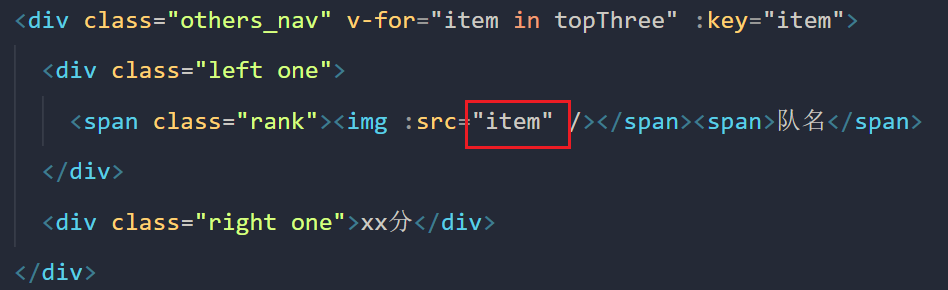

堉琦记录：

1. 独享路由只有 beforeEnter，没有 afterEnter

2. 在 vue3 语法糖中组件内路由守卫无法使用，所以需要再起一个 script 标签使用 defineComponent 方式来使用就可以了

3. 如果引入组件的时候路径报错就重启 vscode，是插件 vetur 的问题

4. 安装 vant 组件库 https://vant-contrib.gitee.io/vant/#/zh-CN

5. console.dir()可以显示一个对象所有的属性和方法

6. 用defineProps给子组件传响应式数据时，在子组件中修改也可响应到父组件（注意：在子组件不要用新的非响应式变量去存储后修改，这样会导致修改的数据无法响应到父组件，要在响应式数据里面修改才可响应）

思敏记录：

1. 利用 v-for 和插值语法放 src 路径，但是没有作用
   

2. 组件间通信，直接使用父传子（v-bind 和 defineProps）传过去的数据，并非响应式，只能用来渲染；使用 provied 和 inject 实现父传子的通讯，传输的数据是响应式的。

3. 小菠萝里面的数据，解构赋值出来只能用于渲染，没有响应式，直接操作小菠萝的数据才行。

4. 自定义组件 template 里面直接写两个同级的 div 在里面，然后引用 v-show 的话会不起效.

5. 注意使用 for-of 遍历改变响应式数据，不会重新解析模板！

```JS
   // 不可以动态修改selectData.ifDiff里面的值
    for (let per of selectData.ifDiff) {
      per = false;
      console.log(per);
    }
    // 可以动态修改selectData.ifDiff里面的值
    for (let index = 0; index < selectData.ifDiff.length; index++) {
      selectData.ifDiff[index] = false;
    }
```

6. style 里面的样式，如果使用 scope 修饰，则创建新的标签节点将使用不了样式，即相应的样式被吞了。

7. 某函数调用 async 修饰的函数修改数据，被调用的函数需要 await 修饰，不然需要修改的数据则不会同步修改
